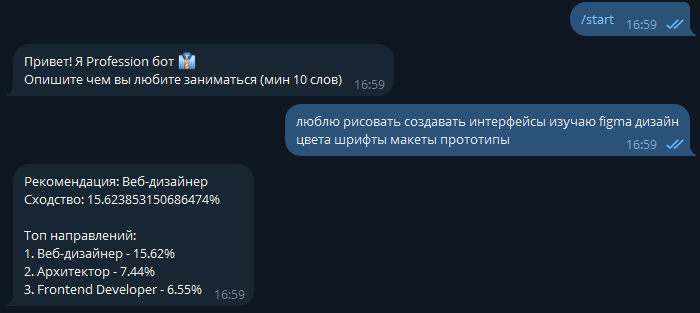

# profession-recommender-bot
Telegram bot that recommends professions based on user interests using TF-IDF and cosine similarity.

## Технологии
- Python
- numpy
- Telebot
- requests
- TfidfVectorizer

## Установка и запуск
1. Клонируй репозиторий
2. Установка зависимости `pip install -r requirements.txt`
3. Подключить ключ Telegram (@BotFather)
4. Включить VPN (Если Telegram заблокирован)
5. Запуск `python professions_bot.py`
